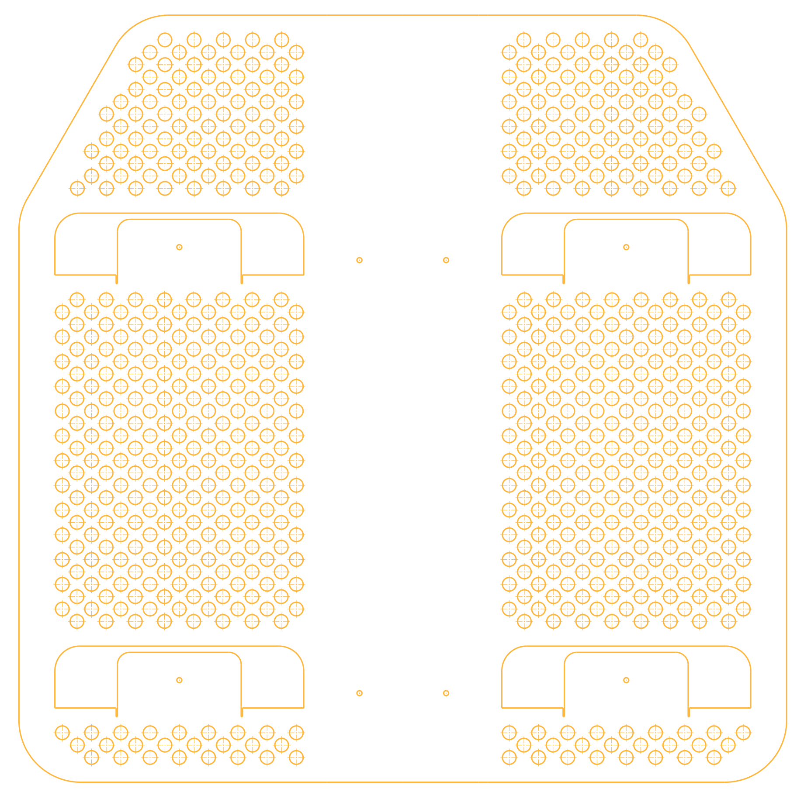

We designed a shelf unit using folded sheet metal as the primary material. Combining metal and wood, we sketched, designed and produced a modern piece of furniture to be manufactured for an industrial design course.

* **Date:** July 2020
* **Author:** Shadi Naguib, Ken Pillonel, Jonas Ulbrich
* **Field of Study:** Industrial Design, CAD
* **Context:** EPFL Ma-1 and Ma-2 *Industrial Design V and VI* project

    

# The Idea

The goal of the project was to create an object based around folded sheet metal. The object needed to be functional, visually pleasing and also has to be simple enough to fit in the manufacturing budget. We decided to work on a shelf unit.

# Design

After doing some small prototyping we decided it would be a mixture of folded aluminium for the structure and wood for the shelves. The shelves would slide into two aluminium frames and hide any screws used to mount the structures to the wall.

Inspired by the *Apple* "cheese grater" look on the newly released Mac Pros, we originally wanted to add holes to our shelf to give it a more open feel so objects placed inside the aluminium structures would not be too hidden. However, after talking with multiple manufacturers, we realised that the addition of the holes would increase the price of the product by nearly 70%, and would like cause warping of the material. We therefore opted for a full sheet metal design.

    

We chose a matte RAL 3022 Salmon pink finnish for the design to give it a smooth feel with vibrant visuals. We chose to pair it with a light wood to stick with the bright theme of the design.

    

 

We created the piece in *Catia V5*, our go-to CAD software. We then uploaded the 3D models to *Blender* and created a studio like environment with different camera and lighting settings to render high quality images that showcase the design. Some more fiddling in *Blender* allowed us export the models in the *.glb* format, letting us showcase a more detailed view here.

<model-viewer id="model" src="../../assets/models/Butterfly.glb" alt="Butterfly Shelf" auto-rotate camera-controls data-js-focus-visible></model-viewer>

 

# Manufacturing

We sent off the plans to our manufacturer and all was set. A few weeks went by and we went to their shop to pick up the unit. We had a funny surprise when we got there, they liked the shelf so much that they decided to manufacture a few extras for themselves! (with our approval of course) However, they did ask after they had already made them… We learned a lesson here too: you need to protect yourself and your designs when you inevitably work with other people. This was just an educational project so it didn’t matter all that much.

    

Here you can see our shelves on the top right, as well as some extra units that the manufacturing company had made for themselves to be on display in their offices.

# Final Product

Some professional pictures were taken of our shelf unit as well as other student projects following the same folded sheet metal theme. We are very happy with the results!

<!-- Slideshow container -->

  <!-- Full-width images with number and caption text -->
  

    
  

  

    
  

  

    
  

  

    
  

  <!-- Next and previous buttons -->
  
&#10094;

  
&#10095;

 

<!-- The dots/circles -->

  
  
  
  

# Additional Material

For any more information on the project, please don't hesitate to contact me <a href="/contact">here</a>.
