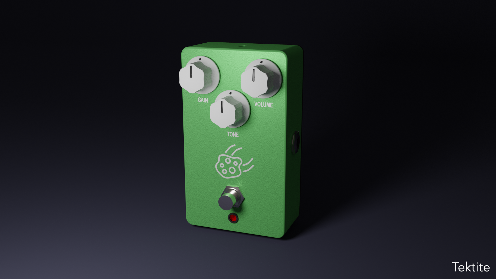

I created a guitar effect pedal collection to showcase my skills in analog circuit design,
CAD design, and rendering.

* **Date:** March 2020
* **Author:** Shadi Naguib
* **Field of Study:** Design, CAD, Electrical Engineering
* **Context:** Personal Project

<!-- Slideshow container -->

  <!-- Full-width images with number and caption text -->
  

    
  

  

    
  

  

    
  

  

    
  

  

    
  

  

    
  

  

    
  

  

    
  

  

    
  

  <!-- Next and previous buttons -->
  
&#10094;

  
&#10095;

 

<!-- The dots/circles -->

  
  
  
  
  
  
  
  
  

# Inspiration

Having played the guitar from a young age, I have used many effect pedals. But it
was only recently that I discovered that the circuits inside were quite similar to
what I had been learning in my electronics and electrical engineering classes. I therefore decided to look into each of my pedals circuit design in more detail.

From this I decided to create a collection of my favourite effects and render them to
simulate a product line to potentially make and release one day.

# Space Theme

I needed to find a theme for the icons to put on each pedal. Along with Robotics, I
also have studied space technologies at EPFL for my Master's degree. So I went with the
**Space** theme for my pedals.

Here is a list of the pedals I have currently designed circuits for:

| Name             | Effect        |
| ---------------- | ------------- |
| Big Dumb Booster | Boost         |
| Chasma           | Chorus        |
| Comet            | Compression   |
| Drag             | Distortion    |
| Fuselage         | Fuzz          |
| Orbit            | Overdrive     |
| Tektite          | Tube Screamer |
| Tidal Force      | Tremolo       |

I have plans for more, including different pedal shapes and sizes, some which can be
found in the 3D model viewer below.

# 3D Models

I created casing for each pedal using *Catia V5*, my go to CAD software. I then uploaded the 3D models in *Blender* and created a studio like setting with different camera and lighting settings to render high quality images that showcase my designs. I used different textures to simulate painted and polished metal finishes and to created icons with *Adobe Illustrator* for each effect.

Some more fiddling in *Blender* allowed me to export the models in the *.glb* format which allowed me to showcase a more detailed view here on my website.

Feel free to have a play around with the models shown below!

<model-viewer id="model" src="../../assets/models/Pedal1.glb" alt="A 3D model of pedal" auto-rotate camera-controls data-js-focus-visible></model-viewer>

  

    

      

        
Next Pedal

      

    

  

 

# Circuits

I have designed circuits for all of the pedals mentioned above and have tested a few of them
including the **Fuselage** fuzz circuit based off the *Electroharmonix Big Muff* Circuit. Here
is its schematic:

  

This circuit uses silicon transistors to create a fuzz effect. It consists of three stages:
* An input booster controlled by the *Sustain* potentiometer
* Following is a clipping amplifier characterised by the clipping diodes *D1* to *D4* and a combination of high and low pass filters controlled with the *Tone* potentiometer
* We finish with an output booster circuit controlled by the *Volume* potentiometer

# Additional Material

For any more information on the project including more circuit diagrams or pedal ideas, please don't hesitate to contact me <a href="/contact">here</a>.
